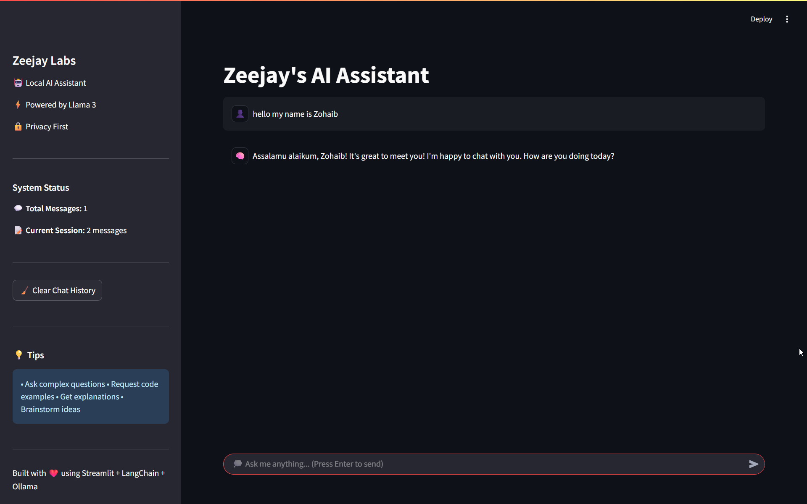
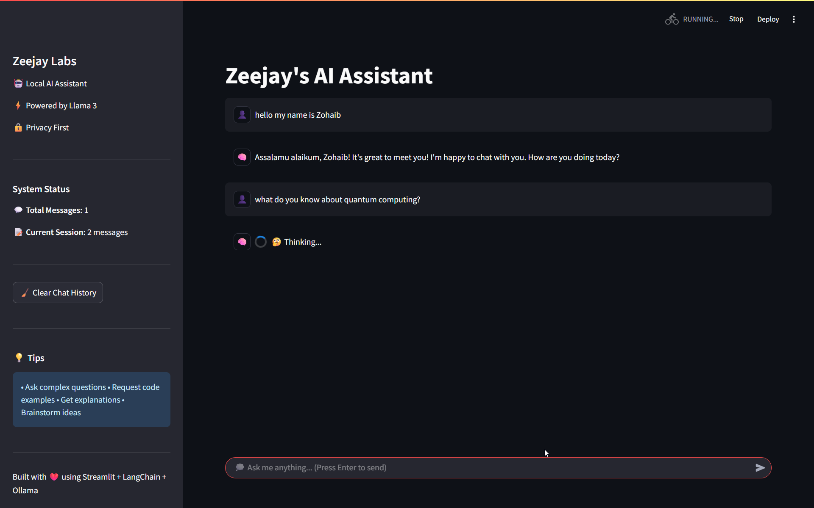
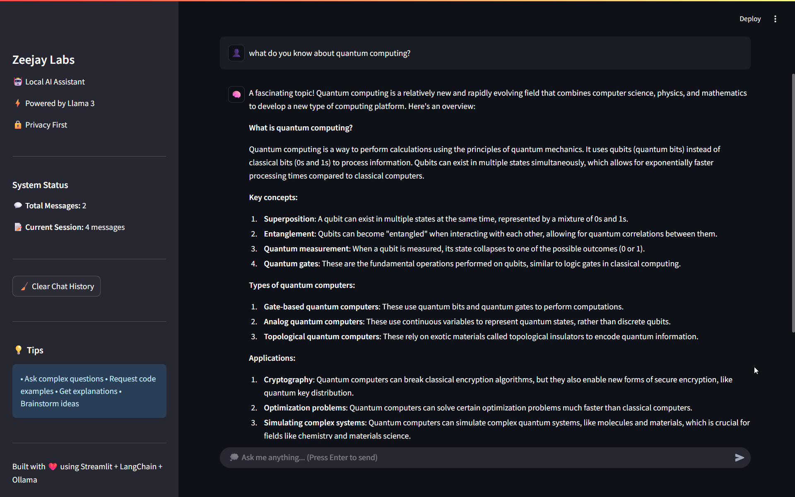

# Zeejay Labs AI Assistant

A lightweight Streamlit application that wraps a local **Llama 3** language model through **LangChain + Ollama** to provide a friendly chat interface. Designed for privacy‑first, offline usage on your own machine, the app keeps chat history in memory and offers quick iteration with zero external dependencies.

---

## ✨ Features

| Feature               | Description                                                                                             |
| --------------------- | ------------------------------------------------------------------------------------------------------- |
| **Local LLM**         | Runs completely on your device using [Ollama](https://ollama.ai) and the *llama3* model—no cloud calls. |
| **Streamlit Chat UI** | Clean two‑column layout (sidebar + main chat) using the newest `st.chat_message` API.                   |
| **Session Memory**    | Keeps a running list of user/assistant messages in `st.session_state`.                                  |
| **Clear History**     | One‑click button resets the current chat session.                                                       |
| **System Metrics**    | Sidebar shows total messages and messages this session.                                                 |
| **Hot Reload**        | Uses `st.rerun()` to refresh the UI seamlessly after each response.                                     |

---

## 📦 Installation

```bash
# 1. Clone the repository
$ git clone https://github.com/your‑org/zeejay‑ai‑assistant.git
$ cd zeejay‑ai‑assistant

# 2. Create a Python virtual environment (optional but recommended)
$ python -m venv .venv
$ source .venv/bin/activate  # Linux/macOS
$ .\.venv\Scripts\activate  # Windows

# 3. Install Python dependencies
$ pip install -r requirements.txt

# 4. Install & pull the LLM with Ollama
$ curl -fsSL https://ollama.ai/install.sh | sh   # follow official instructions for your OS
$ ollama pull llama3
```

---

## 🚀 Running the App

```bash
streamlit run app.py
```

Open the URL printed in your terminal (usually `http://localhost:8501`) in a browser and start chatting!

---

## 🖼️ Screenshots

| Home / Welcome                       | Chat in Action                        | Chat Reply                           |
| ------------------------------------ | ------------------------------------- | ------------------------------------ |
|  |  |  |

---

## 🛠️ Configuration

* **Model Name** – change `OllamaLLM(model="llama3")` in `app.py` if you want to use a different model (e.g., `llama2`, `phi3`, etc.).
* **Page Settings** – tweak `st.set_page_config()` at the top of `app.py` for title, icon, or initial sidebar state.
* **Memory Limits** – the entire chat is stored in RAM; for very long sessions you may want to persist or truncate messages.

---

## 🤝 Contributing

1. Fork the repo
2. Create a feature branch (`git checkout -b feat/my‑feature`)
3. Commit your changes (`git commit -m "feat: add my feature"`)
4. Push to the branch (`git push origin feat/my‑feature`)
5. Open a Pull Request

---

## 📄 License

This project is licensed under the **MIT License**. See `LICENSE` for details.
